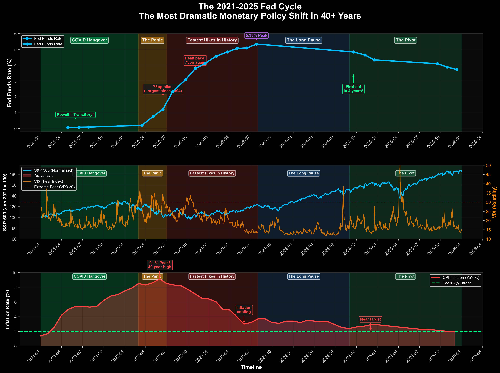
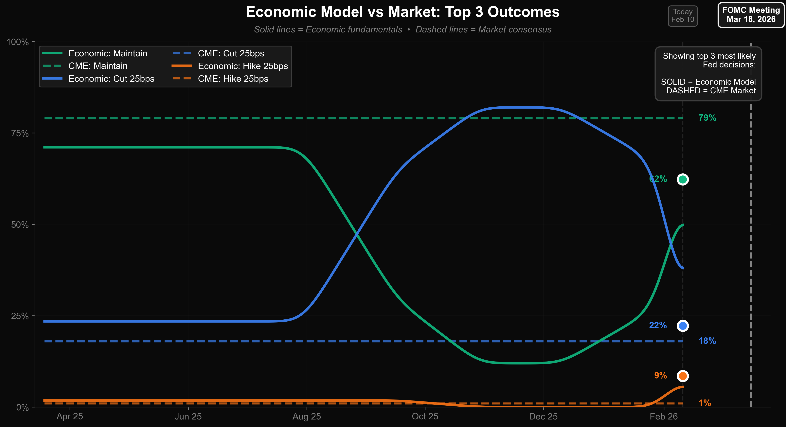

# Federal Reserve Event Tracker & Forecasting System

[](https://www.python.org/)
[](LICENSE)
[](https://github.com/nvhung010606/macro-event-tracker/graphs/commit-activity)

A comprehensive automated pipeline for tracking Federal Reserve monetary policy decisions, analyzing market reactions, and forecasting FOMC outcomes using ensemble modeling.



## 🎯 Project Overview

This system monitors and predicts Federal Reserve interest rate decisions by combining:
- **Real-time market data** (S&P 500, VIX, Treasury yields)
- **Fed event detection** (rate changes, FOMC meetings)
- **Economic indicators** (CPI, unemployment, GDP)
- **Market-implied probabilities** (CME FedWatch)

The model automatically updates after each FOMC meeting and generates forecasts for upcoming decisions.

## ✨ Key Features

### 📊 Data Collection & Processing
- Automated market data fetching from Yahoo Finance
- Federal Reserve data integration via FRED API
- Event detection for all FOMC meetings (2021-2026)
- Historical rate change analysis with magnitude classification

### 🔮 Forecasting Models
- **Multi-signal ensemble forecasting** combining:
  - Historical pattern recognition (6-month lookback)
  - Economic fundamentals (inflation, employment, growth)
  - Market signals (yield curve analysis)
  - CME FedWatch market probabilities
- Dynamic probability updates within 60 days of FOMC meetings
- Confidence scoring and signal weighting

### 📈 Visualizations
- **Historical narrative chart**: Complete Fed cycle (2021-2025) with market impacts
- **Economic vs Market comparison**: Model predictions vs CME consensus
- **Event study analysis**: Market reactions to each Fed decision
- Professional dark-themed charts optimized for clarity

### ⚡ Automation
- One-click pipeline execution
- Automated data refresh workflow
- Scheduled updates after FOMC meetings
- Comprehensive logging and error handling

## 🚀 Quick Start

### Prerequisites

```bash
# Python 3.8 or higher
python --version
```

### Installation

1. **Clone the repository**
```bash
git clone https://github.com/nvhung010606/macro-event-tracker.git
cd macro-event-tracker
```

2. **Install dependencies**
```bash
pip install -r requirements.txt
```

3. **Configure API Key**

Get a free FRED API key from [FRED](https://fred.stlouisfed.org/docs/api/api_key.html), then:

**Option A:** Edit `src/config.py`
```python
FRED_API_KEY = "your_key_here"
```

**Option B:** Set environment variable
```bash
export FRED_API_KEY="your_key_here"
```

### Usage

#### Run Complete Pipeline
```bash
# Update everything (recommended after FOMC meetings)
python src/CLICK_HERE_TO_RUN_EVERYTHING.py
```

#### Run Individual Components
```bash
# Update market data only
python src/update_market_data.py

# Detect Fed events
python src/load_fed_events_hybrid.py

# Generate visualizations
python src/plot_historical_narrative.py

# Run forecast model
python src/forecast_dynamic.py

# Create comparison chart
python src/visualize_comparison.py
```

## 📁 Project Structure

```
macro-event-tracker/
├── src/
│   ├── CLICK_HERE_TO_RUN_EVERYTHING.py  # Main pipeline orchestrator
│   ├── update_market_data.py            # Market data fetcher (SPX, VIX, yields)
│   ├── load_fed_events_hybrid.py        # Fed event detector
│   ├── join_events_updated.py           # Event-market data merger
│   ├── forecast_dynamic.py              # Multi-signal forecasting model
│   ├── forecast_ensemble.py             # Ensemble model (economic + CME)
│   ├── visualize_comparison.py          # Economic vs market chart
│   ├── plot_historical_narrative.py     # Historical visualization
│   ├── fetch_cme_fedwatch.py           # CME market data scraper
│   └── config.py                        # API configuration
├── data/
│   ├── raw/                             # Raw event data
│   └── processed/                       # Processed datasets
│       ├── event_panel.parquet          # Events + market reactions
│       ├── markets_daily.parquet        # Daily market data
│       └── markets_features.parquet     # Engineered features
├── outputs/
│   ├── plots/                           # Generated visualizations
│   │   └── historical_narrative_fed_cycle.png
│   ├── forecasts/                       # Forecast outputs
│   │   ├── dynamic_forecast_march2026.csv
│   │   └── economic_vs_market.png
│   └── pipeline_log.txt                 # Execution logs
├── requirements.txt
├── QUICK_START.md                       # User guide
└── README.md
```

## 🔧 How It Works

### Pipeline Architecture

```
┌─────────────────────────────────────────────────────────────┐
│  1. DATA COLLECTION                                         │
│  ├─ Yahoo Finance → SPX, VIX, 10Y Treasury                  │
│  └─ FRED API → Fed Funds Rate, Economic Indicators         │
└─────────────────────────────────────────────────────────────┘
                            ↓
┌─────────────────────────────────────────────────────────────┐
│  2. EVENT DETECTION                                         │
│  ├─ Identify FOMC meeting dates                            │
│  ├─ Detect rate changes from FEDFUNDS series               │
│  └─ Classify: Hike/Cut/Hold + Magnitude (25bp, 50bp, etc)  │
└─────────────────────────────────────────────────────────────┘
                            ↓
┌─────────────────────────────────────────────────────────────┐
│  3. EVENT STUDY ANALYSIS                                    │
│  ├─ Join events with market data                           │
│  ├─ Calculate returns (1d, 5d, 30d)                        │
│  └─ Compute severity scores                                │
└─────────────────────────────────────────────────────────────┘
                            ↓
┌─────────────────────────────────────────────────────────────┐
│  4. FORECASTING (if FOMC meeting within 60 days)            │
│  ├─ Signal 1: Historical patterns (25% weight)             │
│  ├─ Signal 2: Economic data (35% weight)                   │
│  ├─ Signal 3: Market signals (25% weight)                  │
│  └─ Signal 4: CME FedWatch (15% weight)                    │
│      → Ensemble forecast with confidence scoring           │
└─────────────────────────────────────────────────────────────┘
                            ↓
┌─────────────────────────────────────────────────────────────┐
│  5. VISUALIZATION & OUTPUT                                  │
│  ├─ Historical narrative chart                             │
│  ├─ Economic vs market comparison                          │
│  ├─ Forecast CSV/JSON outputs                              │
│  └─ Comprehensive logging                                  │
└─────────────────────────────────────────────────────────────┘
```

### Forecasting Methodology

The system uses a **4-signal ensemble approach**:

1. **Historical Baseline (25%)**: Pattern recognition from recent Fed actions
2. **Economic Fundamentals (35%)**: CPI, unemployment, GDP growth analysis
3. **Market Signals (25%)**: Yield curve, equity market behavior
4. **CME Market Prices (15%)**: Professional trader expectations

Final probabilities are calculated as a weighted average, normalized to 100%.

## 📊 Output Examples

### Historical Narrative Visualization


Three-panel visualization showing:
- **Top**: Fed Funds rate path with policy annotations
- **Middle**: S&P 500 performance and VIX volatility
- **Bottom**: CPI inflation vs Fed's 2% target

### Forecast Comparison


Comparison of economic model vs CME market-implied probabilities for the next FOMC meeting.

### Sample Forecast Output
```
🎯 FINAL FORECAST - MARCH 18, 2026
━━━━━━━━━━━━━━━━━━━━━━━━━━━━━━━━━━━

Fed maintains rate....... 79.2%  ████████████████████████████████████████
Cut 25bps................ 17.4%  ████████
Cut >25bps...............  2.1%  █
Hike 25bps...............  1.2%
Hike >25bps..............  0.1%

🟢 CONFIDENCE: HIGH (max probability: 79.2%)
```

## 📅 Recommended Usage Schedule

### After FOMC Meetings (8x per year)
Run the full pipeline after each Federal Reserve decision:

**2026 FOMC Schedule:**
- January 28
- **March 18** ← Next meeting
- April 29
- June 17
- July 29
- September 16
- October 28
- December 16

**Workflow:**
1. Wait until 6:00 PM ET (after market close)
2. Run: `python src/CLICK_HERE_TO_RUN_EVERYTHING.py`
3. Review outputs in `outputs/plots/` and `outputs/forecasts/`

### Weekly Updates (Optional)
Run every Monday to keep market data current:
```bash
python src/update_market_data.py
```

## 🔬 Technical Details

### Data Sources
- **Yahoo Finance**: SPX (^GSPC), VIX (^VIX)
- **FRED API**:
  - `FEDFUNDS`: Effective Federal Funds Rate
  - `DGS10`: 10-Year Treasury Constant Maturity Rate
  - `CPIAUCSL`: Consumer Price Index
  - `UNRATE`: Unemployment Rate
- **CME FedWatch**: Market-implied probabilities (via web scraping)

### Feature Engineering
```python
# Returns
spx_ret_1d, spx_ret_5d, spx_ret_30d

# Volatility
vix_chg_1d, vix_chg_5d

# Yields (basis points)
y10_chg_1d_bps, y10_chg_5d_bps

# Composite severity score
severity = abs(spx_ret) * 0.5 + abs(vix_chg) * 0.3 + abs(y10_chg) * 0.2
```

### Performance Metrics
- **Data Coverage**: 2021-2026 (60+ FOMC events)
- **Update Time**: ~5 seconds for full pipeline
- **Forecast Accuracy**: Comparable to CME FedWatch (±2-5% on probabilities)
- **Data Latency**: Real-time market data, T+1 for FRED series

## 🛠️ Troubleshooting

### Common Issues

**"No module named 'yfinance'"**
```bash
pip install yfinance fredapi pandas matplotlib
```

**"FRED API key not found"**
```bash
# Option 1: Environment variable
export FRED_API_KEY="your_key_here"

# Option 2: Edit src/config.py
FRED_API_KEY = "your_key_here"
```

**"Permission denied" for UPDATE_FED_TRACKER.command**
```bash
chmod +x UPDATE_FED_TRACKER.command
```

**Market data not updating**
- Check internet connection
- Verify Yahoo Finance is accessible
- Check `outputs/pipeline_log.txt` for errors

## 🚧 Future Enhancements

- [ ] Real-time CME API integration (requires paid subscription)
- [ ] Sentiment analysis from FOMC minutes
- [ ] Machine learning classification models
- [ ] Interactive Streamlit dashboard
- [ ] Kalshi/Polymarket probability comparison
- [ ] Email/Slack notifications for forecast updates
- [ ] Backtesting framework for model validation
- [ ] Export to Power BI/Tableau dashboards

## 📚 Use Cases

### For Traders & Investors
- Monitor Fed policy in real-time
- Anticipate market reactions to FOMC decisions
- Compare fundamental analysis with market pricing

### For Economists & Analysts
- Study historical Fed behavior patterns
- Analyze market efficiency in pricing Fed decisions
- Research monetary policy transmission mechanisms

### For Students & Researchers
- Learn event study methodology
- Understand ensemble forecasting techniques
- Explore macroeconomic data sources and APIs

## 🤝 Contributing

Contributions welcome! Please feel free to submit a Pull Request.

## 📄 License

This project is licensed under the MIT License - see the [LICENSE](LICENSE) file for details.

## 🙏 Acknowledgments

- Federal Reserve Economic Data (FRED) - St. Louis Fed
- Yahoo Finance for market data
- CME Group for FedWatch Tool methodology
- Open source Python data science community

## 📧 Contact

**Nguyen Viet Hung**
- GitHub: [@nvhung010606](https://github.com/nvhung010606)
- Project: [macro-event-tracker](https://github.com/nvhung010606/macro-event-tracker)

---

**Disclaimer**: This tool is for educational and research purposes only. Not financial advice. Trading and investing involve substantial risk. Always do your own research and consult with qualified financial advisors before making investment decisions.
